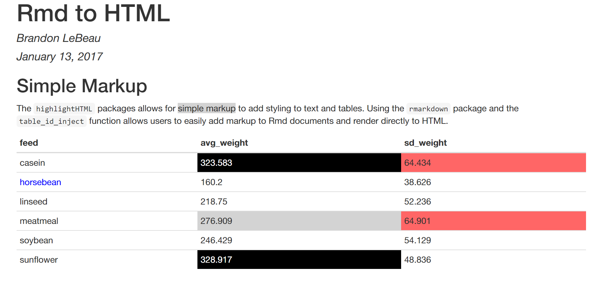

# highlightHTML

[](https://travis-ci.org/lebebr01/highlightHTML)
[](https://codecov.io/github/lebebr01/highlightHTML?branch=master)
[](http://cran.r-project.org/package=highlightHTML)
[](https://doi.org/10.21105/joss.00185)

The highlightHTML package adds markdown syntax to allow for additional styling of (R)markdown documents with HTML output files. The syntax uses HTML id selectors and Cascading Style Sheets (CSS) specified by the user to add the desired style to the HTML output file. The ability to customize the HTML file is limited by the user knowledge of CSS and the ability of CSS to style a given element. 

The hightlightHTML package fits nicely into the workflow of a reproducible research report as the package can dynamically insert the ids into summary tables with R code. In addition, text can be modified directly with simple syntax. Compilation from rmarkdown or markdown to HTML can be done directly from the package which makes use of the render function from the rmarkdown package. Installation and usage details are shown in more detail below.

## Installation 
Installing the package:

```r
install.packages("highlightHTML")
```

or the development version with devtools:

```r
install.packages("devtools")
devtools::install_github('lebebr01/highlightHTML')
```

## Usage

As mentioned above, text and summary tables can be styled using CSS ids or classes. The CSS ids (or classes) are inserted into text by using braces (i.e. \{) with a CSS id hashtag following the opening brace (e.g. `\{#bggrey example\}`). In the previous example, the word "example" would be identified with the CSS id #bggrey and could be styled using CSS. 

There are two ways to create styling within a markdown summary table. The first option is useful if the markdown summary table is created manually (i.e. type by hand). In this scenario you simply need to add the hashtag to the desired cell of the summary table. Perhaps the more common workflow for adding hashtags to a summary table would be dynamically with R code. To do this, the function `table_id_inject` is used to create conditional arguments for adding the hashtags to a markdown summary table. This is shown in more detail with the example below.

## Adding CSS ids manually
Suppose you have a summary table like the following (note: this table was created by typing manually, a more typical workflow is shown later using R directly):

| Color Name | Number       |
|----------- | ------------ |
| Red        |  25          |
| Blue       |  40          |
| Green      |  4           |
| Orange     |  87          |

You could then add styling by adding the following tags to the table, again this was added by hand, but a conditional example with R is shown later.

| Color Name | Number       |
|----------- | ------------ |
| Red        |  25  #bgred  |
| Blue       |  40  #bgblue |
| Green      |  4           |
| Orange     |  87          |

The addition of the *#bgblue* and *#bgred* indicates which cells will be changed. After turning the markdown document into an html file, this package can now be used to post-process the html file. The post-processing will add an id value for each cell with the *#bgblue* or *#bgred* and remove those from the table. 

The CSS for these ids could be as simple as the following to change the background color of the cells with the CSS id inserted above:

````
#bgred {background-color: #FF0000;}
#bgblue {background-color: #0000FF;}
````

## Simple Example of Common Package Workflow

Below is a simple example of an Rmd document that combines both elements, text markup and inserting CSS ids dynamically into a table using R code and the `table_id_inject` function. The summary table below is calculating the mean and standard deviation of the chick weights by different feed types. You can imagine creating a similar table in reports that you create.

````
---
title: "Rmd to HTML"
author: "Brandon LeBeau"
date: "January 13, 2017"
output: html_document
---

## Simple Markup
The `highlightHTML` packages allows for {#bggrey simple markup} to add styling to text and tables. Using the `rmarkdown` package and the `table_id_inject` function allows users to easily add markup to Rmd documents and render directly to HTML.

```{r symm, echo = FALSE, results = 'asis', message = FALSE}
library(dplyr)
library(highlightHTML)

chickwts %>%
  group_by(feed) %>%
  summarise(avg_weight = mean(weight),
            sd_weight = sd(weight)) %>%
  mutate(feed = as.character(feed)) %>%
  table_id_inject(id = c('#bggrey', '#bgblack', '#bglightred', '#textblue'), 
                conditions = c('> 270', '> 300', '> 60', '== "horsebean"'),
                variable = list('avg_weight', 'avg_weight', 'sd_weight', 'feed'),
                num_digits = 3) %>%
  knitr::kable(format = 'markdown')
```
````

The resulting summary table would look like the following in markdown:

|feed                |avg_weight       |sd_weight          |
|:-------------------|:----------------|:------------------|
|casein              |323.583 #bgblack |64.434 #bglightred |
|horsebean #textblue |160.2            |38.626             |
|linseed             |218.75           |52.236             |
|meatmeal            |276.909 #bggrey  |64.901 #bglightred |
|soybean             |246.429          |54.129             |
|sunflower           |328.917 #bgblack |48.836             |

It is worth discussing the `table_id_inject` function in more detail here. The function takes two required arguments, `id` and `conditionals` and two optional arguments, `variable` and `num_digits`. The two required arguments are a vector of CSS ids (e.g. #bggrey) and a vector of conditional expressions that are evaluated to identify the location to insert the CSS id. These two arguments must be the same length and the CSS id and conditional expression are matched by location. That is, the first element of each argument are matched, the second element of each, and so on. The optional argument, `variable`, specifies which column(s) of the data to evaluate the conditional expression on. By default this argument is empty meaning that the conditional expressions are evaluated on every column. If a CSS id is specific to a specific column(s), this argument, specified as a list, can be included to limit the conditional expression to be evaluated on only the column(s) of interest. Finally, the optional `num_digits` argument is used to round the numeric columns. See `round` for more details.

Finally, the Rmd file itself can be passed to the `highlight_html` function which will automatically compile the input file into an HTML output file. The `highlight_html` function takes three main arguments, the path to the input Rmd file (can also be a markdown or HTML file), the path to save the output HTML file, and the CSS styling to be used for the styling Below is the example of processing the simple example shown above. 


```r
library(highlightHTML)
file <- system.file('examples', 'joss.Rmd', package = 'highlightHTML')

tags <- c('#bgblack {background-color: black; color: white;}',
          '#bggrey {background-color: #d3d3d3;}',
          '#bglightred {background-color: #FF6666;}',
          '#textblue {color: blue}')

highlight_html(input = file, output = tempfile(fileext = ".html"),
               tags = tags, browse = TRUE, render = TRUE)
```

The resulting HTML file now looks like the following:



Finally, the `highlight_html` function has an optional argument called `browse`. This argument is a TRUE/FALSE flag, which defaults to TRUE, to indicate whether the HTML output file should be opened in the default browser upon successful compilation. This can be a good way to view the file to ensure the desired styling was achieved.

## Vignette
Additional examples can be found in the vignette called, The Basics. This file give more information and examples. The vignette should come with the package when installed from CRAN. 


```r
vignette('the_basics', package = 'highlightHTML')
```


If you are using the developmental version from GitHub, you may need to tell the installer to build the vignette directly:


```r
devtools::install_github('lebebr01/highlightHTML', build_vignettes = TRUE)
```

