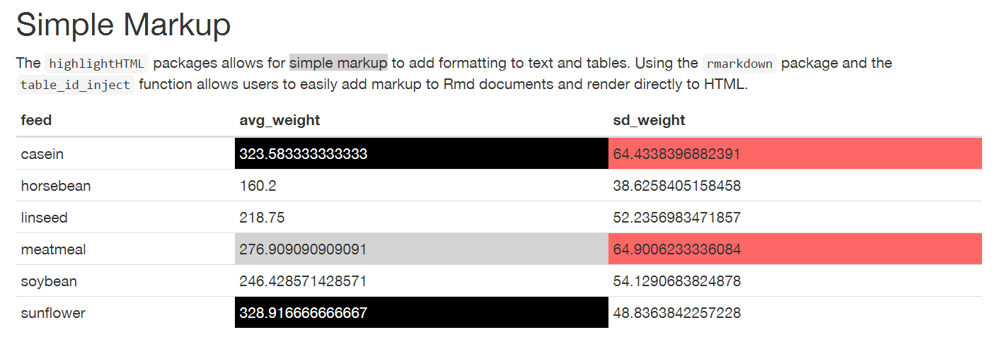

# Summary

Markdown is a markup language with light formatting options and has become popular within the R community for creating dynamic, reproducible reports. The benefits of this approach to reproducible reports include a simple syntax and the focus is on the content rather than appearance. However, there are times when formatting is useful to highlight aspects of a table or text more generally within a report. The highlightHTML package [@highlighthtml] is an R package [@r-base] that extends the basic formatting of markdown documents using Cascading Style Sheets (CSS) and HTML ids. As CSS is used to do the formatting, the limits in the styles that can be implemented are up to the amount of CSS knowledge the author has. 

The hightlightHTML package fits nicely into the workflow of a reproducible research report as the package can dynamically insert the ids into tables with R code. Lastly, compilation to HTML can be done directly from the package which takes use of the render function from the rmarkdown package [@rmarkdown]. The package vignette includes more information on this package.

# References
