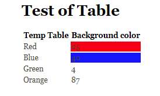
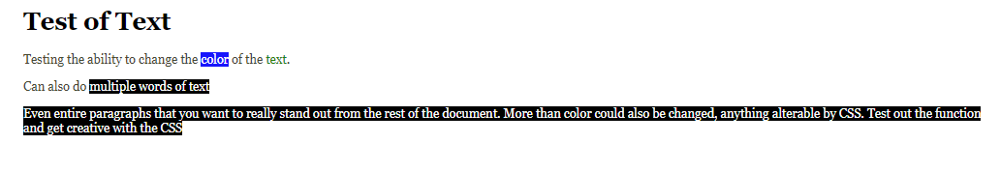

Have you ever wanted to include some form of styling, either conditional or nonconditional, when going from a (R)markdown input document to a html output document? If so, this package may be worthwhile to you. The `highlightHTML` package inject CSS into the output HTML document automatically via CSS ids and classes (more information on CSS ids and classes: <http://www.cssbasics.com/css-ids/> and <http://www.cssbasics.com/css-classes/>). 

The examples below start by showing the syntax in somewhat trivial examples initially. This is done to help show the markdown syntax a bit more simply. Toward the end of the document, a more typical workflow going from Rmd to HTML is shown that puts all the pieces together.

# Basic Example
Suppose you have a summary table like the following (note: this table was created by typing manually, a more typical workflow is shown later using R directly):

| Color Name | Number       |
|----------- | ------------ |
| Red        |  25          |
| Blue       |  40          |
| Green      |  4           |
| Orange     |  87          |

You could then add styling by adding the following tags to the table, again this was added by hand, but a conditional example with R is shown later.

| Color Name | Number       |
|----------- | ------------ |
| Red        |  25  #bgred  |
| Blue       |  40  #bgblue |
| Green      |  4           |
| Orange     |  87          |

The addition of the *#bgblue* and *#bgred* indicates which cells will be changed. After turning the markdown document into an html file, this package can now be used to post-process the html file. The post-processing will add an id value for each cell with the *#bgblue* or *#bgred* and remove those from the table. 

The function to use for the post-processing is `highlight_html` and requires three arguments, the input file, the output file, and the CSS tags themselves. This will look something like the following using an example file from the package:

```{r function, eval=FALSE}
library(highlightHTML)
file <- system.file('examples', 'bgtable.html', 
                    package = 'highlightHTML')
tags <- c("#bgred {background-color: #FF0000;}", 
  "#bgblue {background-color: #0000FF;}")
highlight_html(input = file, 
               output = tempfile(fileext = ".html"), 
               tags = tags,
               browse = TRUE,
               print = FALSE, 
               render = FALSE)
```

In the above `highlight_html` function call, the output file is saved to a temporary file. The `update_css` argument will inject the tags into the html document within any style tags that are found within the document. The `browse` argument will open the resulting post-processed file in the default browser to be viewed directly. Finally, the `print` argument if TRUE, will print the html output to the R console. This may be useful for verification of potential errors in the post-processing. The `render` argument is set to FALSE here (TRUE is the default) as the input file was already an HTML file. 




# Styling Text
Styling text is also simple in a markdown document. Braces `{}` are used to identify text that should be styled A CSS id tag is then added to link this to the CSS styling 

For example, perhaps there is `{#colgold some text}` to turn gold. In the previous example, the text "some text" would be processed to be styled using the CSS id #colgold. 

Another example file can be run with the following commands to show more text styling examples:
```{r text, eval = FALSE}
file <- system.file('examples', 'bgtext.html', package = 'highlightHTML')

# Change background color and text color with CSS
tags <- c("#bgblack {background-color: black; color: white;}", 
  "#bgblue {background-color: #0000FF; color: white;}",
  "#colgreen {color: green;}")
  
# Post-process HTML file
highlight_html(input = file, output = tempfile(fileext = ".html"),
               tags = tags, browse = TRUE, render = FALSE)
```

The same argument calls are valid as discussed above when post-processing tables.



# From (R)markdown to HTML directly.
A more typical workflow for the highlightHTML package is to go from an (R)markdown document and compile it directly with the `highlight_html` function to create the output HTML file. Another benefit of this workflow, is the ability to use the `table_id_inject` function. This function allows the injection of CSS ids into summary tables created within R using conditional expressions. More on this function in the simple example below.

## Simple Example of Package Workflow

Below is a simple example of an Rmd document that combines both elements, text markup and inserting CSS ids dynamically into a summary table using  R code and the `table_id_inject` function. The summary table below is calculating the mean and standard deviation of the chick weights by different feed types. You can imagine creating a similar table in reports that you create.

````
---
title: "Rmd to HTML"
author: "Brandon LeBeau"
date: "January 13, 2017"
output: html_document
---

## Simple Markup
The `highlightHTML` packages allows for {#bggrey simple markup} to add styling to text and tables. Using the `rmarkdown` package and the `table_id_inject` function allows users to easily add markup to Rmd documents and render directly to HTML.

```{r symm, echo = FALSE, results = 'asis', message = FALSE}`r ''`
library(dplyr)
library(highlightHTML)

chickwts %>%
  group_by(feed) %>%
  summarise(avg_weight = mean(weight),
            sd_weight = sd(weight)) %>%
  mutate(feed = as.character(feed)) %>%
  table_id_inject(id = c('#bggrey', '#bgblack', '#bglightred', '#textblue'), 
                conditions = c('> 270', '> 300', '> 60', '== "horsebean"'),
                variable = list('avg_weight', 'avg_weight', 'sd_weight', 'feed'),
                num_digits = 3) %>%
  knitr::kable(format = 'markdown')
```
````

The resulting summary table would look like the following in markdown:
```{r symm, echo = FALSE, results = 'asis', message = FALSE}
library(dplyr)
library(highlightHTML)

chickwts %>%
  group_by(feed) %>%
  summarise(avg_weight = mean(weight),
            sd_weight = sd(weight)) %>%
  mutate(feed = as.character(feed)) %>% 
  data.frame() %>%
  table_id_inject(id = c('#bggrey', '#bgblack', '#bglightred', '#textblue'), 
                conditions = c('> 270', '> 300', '> 60', '== "horsebean"'),
                variable = list('avg_weight', 'avg_weight', 'sd_weight', 'feed'),
                num_digits = 3) %>%
  knitr::kable(format = 'markdown')
```

It is worth discussing the `table_id_inject` function in more detail here. The function takes two required arguments, `id` and `conditionals` and two optional arguments, `variable` and `num_digits`. The two required arguments are a vector of CSS ids (e.g. #bggrey) and a vector of conditional expressions that are evaluated to identify the location to insert the CSS id. These two arguments must be the same length and the CSS id and conditional expression are matched by location. That is, the first element of each argument are matched, the second element of each, and so on. The optional argument, `variable`, specifies which column(s) of the data to evaluate the conditional expression on. By default this argument is empty meaning that all columns are evaluated. If a CSS id is specific to a specific column(s), this argument specified as a list can be included. Finally, the optional `num_digits` argument is used to round the numeric columns. See `round` for more details.

Finally, the Rmd file itself can be passed to the `highlight_html` function which will automatically compile the input file into an HTML output file. The `highlight_html` function takes three main arguments, the path to the input Rmd file (can also be a markdown or HTML file), the path to save the output HTML file, and the CSS styling to be used for the styling Below is the example of processing the simple example shown above. 

```{r joss_compile, eval=FALSE}
library(highlightHTML)
file <- system.file('examples', 'joss.Rmd', package = 'highlightHTML')

tags <- c('#bgblack {background-color: black; color: white;}',
          '#bggrey {background-color: #d3d3d3;}',
          '#bglightred {background-color: #FF6666;}',
          '#textblue {color: blue}')

highlight_html(input = file, output = tempfile(fileext = ".html"),
               tags = tags, browse = TRUE, 
               render = TRUE)
```

The results HTML output file now looks like the following:


Finally, the `highlight_html` function has an optional argument called `browse`. This argument is a TRUE/FALSE flag, which defaults to TRUE, to indicate whether the HTML output file should be opened in the default browser upon successful compilation. This can be a good way to view the file to ensure the desired styling was achieved.
